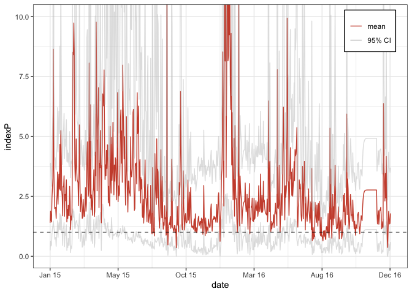

# MVSE

MVSE, Mosquito-borne Viral Suitability Estimator, provides methods for
the estimation of an index of climate-based transmission potential for
mosquito-borne viruses. It can be parameterized for any combination of
host, virus and mosquito-species of interest with local climate data.

## Installation

The MVSE package is currently not hosted on CRAN (Comprehensive R
Archive Network). We thus need to install the package directly from the
GithHub repo where it is hosted.

``` r
install.packages("devtools")
install.packages("tidyverse")
require(tidyverse)
require(devtools)

install_github("TaishiNakase/MVSE")
```

## Example

Let’s go through a short example of how one might use MVSE to estimate
Index P for some mosquito-borne virus.

First, we will install some packages.

``` r
library(MVSE)
```

We first need to create a `mvse_model` object, which requires time
series data for climatic variables (i.e. temperature, humidity and
rainfall) as well as epi-entomological prior distributions for the
virus/vector/host system of interest.

``` r
# climate data
data("climateFSA")

# user-defined model
priors <- list(mosq_life_exp=list(pars=c(mean=12, sd=2), dist="normal"),
               mosq_inc_per=list(pars=c(mean=7, sd=2), dist="normal"),
               mosq_biting_freq=list(pars=c(mean=0.25, sd=0.01), dist="normal"),
               human_life_exp=list(pars=c(mean=71.1, sd=2), dist="normal"),
               human_inc_per=list(pars=c(mean=5.8, sd=1), dist="normal"),
               human_inf_per=list(pars=c(mean=5.9, sd=1), dist="normal"))
example_mvse_model <- mvse_model(model_name="user_test", climate_data=climateFSA, priors=priors)
```

Let’s take a look at the input data to be used in the sampling
procedure.

``` r
example_mvse_model
#> Class: mvsemodel 
#> Model name: user_test 
#> Model category: user-defined 
#> Climate data (limited to first 10 rows): 
#>          date     T     H
#> 1  2015-01-01 27.54 65.25
#> 2  2015-01-02 26.06 72.75
#> 3  2015-01-03 25.58 71.00
#> 4  2015-01-04 24.62 73.50
#> 5  2015-01-05 26.26 75.75
#> 6  2015-01-06 26.50 77.50
#> 7  2015-01-07 25.38 81.75
#> 8  2015-01-08 24.22 95.25
#> 9  2015-01-09 24.50 85.25
#> 10 2015-01-10 25.10 80.25
#> Priors: 
#>   Mosquito life expectancy (days)        : normal(mean=12, sd=2) 
#>   Mosquito incubation period (days)      : normal(mean=7, sd=2) 
#>   Mosquito biting frequency (bites/female/day)   : normal(mean=0.25, sd=0.01) 
#>   Human life expectancy (years)          : normal(mean=71.1, sd=2) 
#>   Human incubation period (days)         : normal(mean=5.8, sd=1) 
#>   Human infectious period (days)         : normal(mean=5.9, sd=1)
```

Next, let’s perform the MCMC (Markov chain Monte Carlo) sampling
procedure to estimate Index P.

``` r
example_mvse_fit <- sampling(example_mvse_model, verbose=FALSE)
```

Finally, let’s take a look at the estimated distribution of the time
series of Index P.

``` r
indexP_plot <- mcmc_index_dist(example_mvse_fit, index="indexP")
indexP_plot
```


